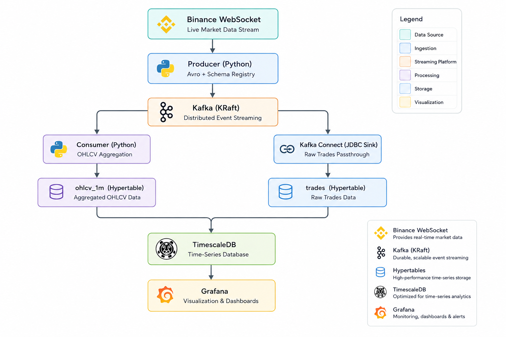

# Sentry

Real-time BTC/USDT trade pipeline — Binance WebSocket → Kafka → TimescaleDB → Grafana.

## Architecture



## Stack

| Layer | Technology |
|---|---|
| Ingestion | Binance WebSocket (`wss://stream.binance.com`) |
| Messaging | Apache Kafka 4.3 (KRaft, no ZooKeeper) |
| Schema | Confluent Schema Registry + Avro |
| Sink (raw) | Kafka Connect JDBC → `trades` hypertable |
| Sink (OHLCV) | Python consumer → `ohlcv_1m` hypertable |
| Storage | TimescaleDB (PostgreSQL 16) |
| Dashboards | Grafana 11.5 |
| Management | Kafka UI · PgAdmin |

## Services

```
localhost:9092   Kafka (internal)
localhost:29092  Kafka (external / local dev)
localhost:8081   Schema Registry
localhost:8080   Kafka UI
localhost:8083   Kafka Connect
localhost:5432   TimescaleDB
localhost:5050   PgAdmin
localhost:3000   Grafana
```

## Getting Started

**Prerequisites:** Docker Desktop, Python 3.11+

**1. Configure environment**

```bash
cp .env.example .env
# edit .env with your credentials
```

**2. Start the stack**

```powershell
./setup.ps1
```

This starts all Docker services, creates Kafka topics, and registers the Kafka Connect JDBC sink.

**3. Start the producer**

```bash
cd producer
cp .env.example .env
python -m src.main
```

**4. Start the OHLCV consumer** (separate terminal)

```bash
cd consumer
cp .env.example .env
python -m src.main
```

## Data Model

### `trades` — raw tick data (via Kafka Connect)

| Column | Type | Description |
|---|---|---|
| trade_id | BIGINT | Binance trade ID |
| event_type | TEXT | Event type (`trade`) |
| event_time | TIMESTAMPTZ | Binance event timestamp |
| symbol | TEXT | Trading pair (`BTCUSDT`) |
| price | TEXT | Execution price |
| quantity | TEXT | Trade quantity |
| trade_time | TIMESTAMPTZ | Trade execution timestamp (partition key) |
| is_buyer_maker | BOOLEAN | Whether buyer is market maker |

### `ohlcv_1m` — 1-minute candles (via Python consumer)

| Column | Type | Description |
|---|---|---|
| symbol | TEXT | Trading pair |
| window_start | TIMESTAMPTZ | Candle open time (partition key) |
| open | NUMERIC | First trade price |
| high | NUMERIC | Highest trade price |
| low | NUMERIC | Lowest trade price |
| close | NUMERIC | Last trade price |
| volume | NUMERIC | Total traded quantity |
| trade_count | INTEGER | Number of trades in window |

## Project Structure

```
sentry/
├── producer/         # Binance WebSocket → Kafka (Avro)
│   └── src/
│       ├── client/   # WebSocket client + reconnect logic
│       ├── kafka/    # Producer + Avro serializer
│       ├── schemas/  # btc_trade.avsc
│       └── transform/# Binance payload → domain record
├── consumer/         # Kafka → OHLCV → TimescaleDB
│   └── src/
│       ├── kafka/    # Consumer + Avro deserializer
│       ├── transform/# OHLCV accumulator
│       └── db/       # TimescaleDB writer
├── grafana/          # Dashboard + datasource provisioning
├── kafka-connect/    # JDBC sink connector config
├── timescaledb/      # init.sql (hypertables)
├── docker-compose.yml
└── setup.ps1
```
